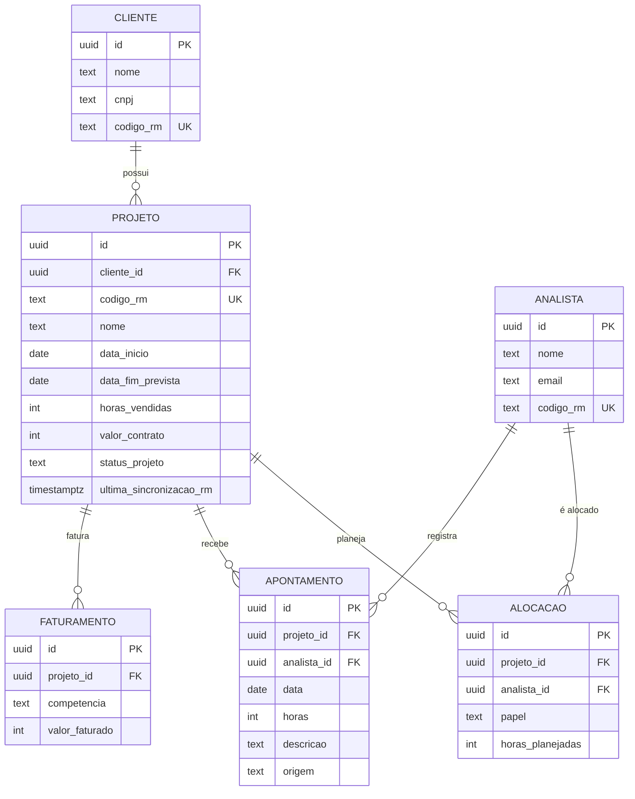
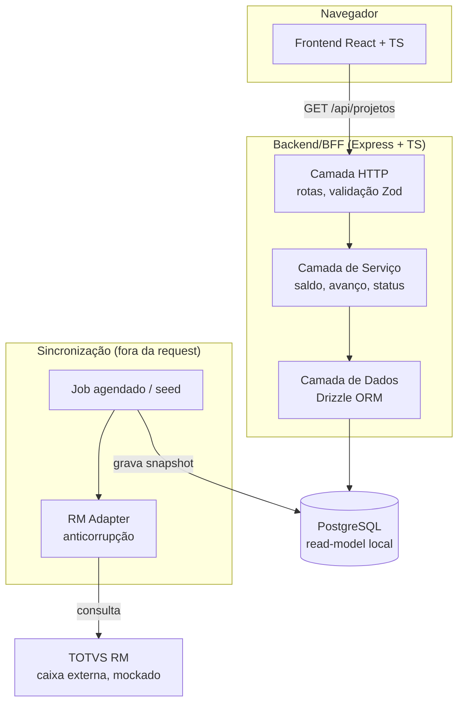

# Painel de Projetos: design técnico

Case técnico PVT Software & Serviços · Parte 1 (Design e Arquitetura)
Autor: Luiz Filipe B Miranda

Este documento descreve o projeto técnico do módulo "Painel de Projetos" do portal de gestão da PVT: modelagem de domínio, arquitetura, API, regras de negócio, trade-offs e caminho de evolução. O TOTVS RM é tratado como caixa externa (fonte oficial dos dados), simulado por um mock. Uma fatia do desenho está implementada e roda com um comando; ver o [README](../README.md).

## 1. Modelagem do domínio

O problema pede seis entidades. O diagrama resume como se relacionam:



Como as peças se encaixam:

- Cliente 1:N Projeto. Um cliente pode ter vários projetos em andamento.
- Projeto N:N Analista, através de duas tabelas-ponte com papéis diferentes: Alocação carrega o planejado (quanto se planejou de cada analista no projeto) e Apontamento carrega o realizado (horas efetivamente trabalhadas).
- Projeto 1:N Faturamento, a dimensão financeira, registrada por competência (mês).
- Todo registro espelhado do ERP guarda seu `codigo_rm`, a chave natural no RM. É o que permite re-sincronizar sem duplicar.

As três dimensões de horas que a coordenação precisa enxergar saem daí:

| Dimensão | Origem |
|---|---|
| Vendido | `projeto.horas_vendidas` (contrato/proposta) |
| Planejado | `SUM(alocacao.horas_planejadas)` |
| Realizado | `SUM(apontamento.horas)` |

Três escolhas de modelagem pedem explicação.

**Saldo, avanço e status não são colunas.** São derivados, calculados na camada de serviço a partir do fato-base. Persistir o cálculo criaria duas fontes de verdade que cedo ou tarde divergiriam; derivando, um apontamento novo muda o saldo já na consulta seguinte. A seção 6 mostra quando vale materializar.

**O planejado mora na Alocação, não no Projeto.** Planeja-se por pessoa: João entra com 120h, Maria com 80h. Somar alocações dá o planejado do projeto e ainda permite comparar planejado com realizado por analista. De quebra, a Alocação ganha um propósito real além de ligar tabelas.

**Faturamento existe por causa da definição de criticidade.** O case define projeto crítico também como "entrega física atrasada em relação ao financeiro". Detectar isso exige comparar o avanço físico (horas) com o avanço financeiro (quanto já se faturou do contrato). Sem uma entidade de faturamento esse critério seria incalculável e o modelo perderia metade da definição de crítico.

## 2. Arquitetura da solução

O princípio central: **o painel nunca consulta o RM durante a request do usuário.** ERPs de retaguarda são lentos e saem do ar; um painel que depende deles em tempo real herda os dois problemas. A solução é manter um read-model local no PostgreSQL, um snapshot dos dados do RM, sincronizado em segundo plano.



As camadas do backend têm responsabilidades estritas:

1. HTTP recebe a request, valida entrada (Zod) e formata a resposta. Nenhuma regra de negócio.
2. Serviço calcula saldo, percentuais e status. Não conhece HTTP nem SQL.
3. Dados consulta o banco via Drizzle. Não conhece regra de negócio.

Essa separação deixa as regras, que são a parte do módulo que mais importa, em funções puras: dá para testá-las sem servidor e sem banco.

O dado percorre dois caminhos distintos. Na leitura (síncrona), navegador → API → Postgres: rápida, sempre disponível e sem tocar o RM. Na ingestão (assíncrona), a sincronização usa o RM Adapter para consultar o ERP e grava o snapshot no Postgres. Só nesse segundo caminho o RM é acessado.

O RM Adapter é uma camada anticorrupção: traduz o modelo do ERP (códigos, nomes de campos, formatos) para o nosso domínio. Se o RM mudar um layout, o impacto fica contido no adapter. Na implementação, o adapter devolve dados mockados e o "job" é um seed que roda na subida do backend; em produção seria um worker agendado (a seção 6 detalha).

Essa arquitetura tem um efeito colateral que vale registrar: se o RM cair, o painel continua no ar, servindo o último snapshot. Cada projeto carrega `ultima_sincronizacao_rm` e a interface mostra a idade do dado. O usuário sabe que está vendo uma foto, e de quando ela é.

## 3. Design da API

REST, base `/api`. O painel precisa de seis endpoints; o primeiro está implementado na Parte 2.

| # | Verbo | Recurso | Retorna |
|---|---|---|---|
| 1 (implementado) | GET | `/projetos` | Lista de projetos com horas, saldo, percentuais e status calculados. Filtros: `?status=`, `?clienteId=`, `?busca=` |
| 2 | GET | `/projetos/:id` | Detalhe: breakdown de horas, financeiro, motivos de criticidade, alocações e faturamentos |
| 3 | GET | `/projetos/:id/apontamentos` | Apontamentos do projeto, paginados |
| 4 | POST | `/apontamentos` | Registra apontamento de horas. Body: `{ projetoId, analistaId, data, horas, descricao }` |
| 5 | GET | `/clientes` | Clientes, para o filtro do painel |
| 6 | GET | `/projetos/resumo` | Agregados do topo: total de projetos, contagem por status, saldo total |

Um item de `GET /projetos` responde assim:

```jsonc
{
  "id": "…",
  "codigoRm": "PRJ-1042",
  "nome": "Implantação RM — Banco XPTO",
  "cliente": { "id": "…", "nome": "Banco XPTO" },
  "horas": { "vendidas": 200, "planejadas": 200, "realizadas": 140, "saldo": 60 },
  "percentualAvanco": 70,
  "percentualFinanceiro": 85,
  "status": "atencao",
  "motivosCriticidade": [],
  "ultimaSincronizacaoRm": "2026-07-14T12:00:00Z"
}
```

Decisões por trás desse formato:

- O cálculo mora no backend. O front recebe saldo e status prontos, a regra de negócio vive num único lugar e qualquer outra tela ou cliente da API recebe exatamente os mesmos números. O front só apresenta.
- `motivosCriticidade` é uma lista porque um projeto pode estourar horas e, ao mesmo tempo, estar com o físico atrasado. O rótulo "crítico" sozinho não diz o que fazer; a causa diz.
- `ultimaSincronizacaoRm` vai em toda resposta. É a transparência da consistência eventual: o front exibe "dados de X min atrás".
- Verbos com a semântica correta. GET nunca tem efeito colateral (navegadores e proxies assumem que podem repetir ou pré-carregar um GET); tudo que escreve é POST. Registrar apontamento e disparar sincronização são ações, logo POST.

## 4. Regras de negócio

Quatro cálculos, todos em funções puras na camada de serviço.

Saldo de horas, quanto resta do contratado:

```
saldo = horas_vendidas − horas_realizadas
```

Positivo: há horas a consumir. Zero: no limite. Negativo: estouro.

Percentual de avanço físico, o consumo do esforço vendido:

```
percentualAvanco = (horas_realizadas / horas_vendidas) × 100
```

É um avanço por proxy de horas (não mede qualidade de entrega) e pode passar de 100%. Quando passa, é estouro.

Percentual financeiro, quanto do contrato já foi faturado:

```
percentualFinanceiro = (Σ faturamentos / valor_contrato) × 100
```

A classificação de status avalia dois sinais de risco independentes; o status final é o pior dos dois (worst-wins) e cada sinal crítico registra seu motivo.

Sinal A, consumo de horas:

| `percentualAvanco` | Sinal |
|---|---|
| ≤ 85% | saudável |
| > 85% e ≤ 100% | atenção |
| > 100% | crítico → `estouro_horas` |

Sinal B, físico vs financeiro (`gap = percentualFinanceiro − percentualAvanco`):

| Gap | Sinal |
|---|---|
| < 10 pp | saudável |
| ≥ 10 e < 20 pp | atenção |
| ≥ 20 pp | crítico → `fisico_atras_financeiro` |

O sinal B captura o risco que as horas sozinhas escondem: faturou-se 75% do contrato mas entregou-se 40% do esforço, ou seja, o projeto "deve" entrega ao cliente. Os quatro projetos do seed cobrem os cenários:

| Projeto | Vendido | Realizado | %Físico | %Financeiro | Gap | Status | Motivo |
|---|---|---|---|---|---|---|---|
| Banco XPTO | 200h | 140h | 70% | 85% | +15 | atenção | nenhum |
| Varejo ABC | 100h | 105h | 105% | 90% | −15 | crítico | estouro de horas |
| Indústria K | 300h | 120h | 40% | 75% | +35 | crítico | físico atrás do financeiro |
| Tech Startup | 160h | 80h | 50% | 50% | 0 | saudável | nenhum |

Os limiares (85%, 100%, 10 pp, 20 pp) são constantes nomeadas num único módulo de configuração (`config/thresholds.ts`). São um ponto de partida razoável; a calibração fina é decisão da coordenação, e trocá-los não exige caçar magic numbers pelo código.

## 5. Decisões e trade-offs

| Decisão | Motivo | Preço aceito |
|---|---|---|
| Read-model local em vez de consultar o RM por request | Painel rápido e disponível mesmo com ERP fora | Consistência eventual, mitigada ao expor a idade do dado |
| Métricas derivadas, não persistidas | Fonte única de verdade; impossível dessincronizar | Cálculo a cada request (barato nesta escala; ver seção 6) |
| Faturamento como entidade própria | Sem ela, o critério "físico vs financeiro" não existe | Uma tabela e um seed a mais |
| Planejado na Alocação | Realista (planeja-se por pessoa); permite análise por analista | Um SUM a mais na consulta |
| PostgreSQL + Drizzle | Relacional maduro; ORM TypeScript-first leve, SQL transparente; ferramentas onde tenho maior domínio | Exige Docker para rodar local |
| Express + Zod | Também por serem ferramentas onde tenho bastante domínio; onipresente, simples, validação explícita nas bordas | Menos "baterias inclusas" que um framework opinativo |
| Monorepo com camadas HTTP/Serviço/Dados | Separação de responsabilidades; regras testáveis isoladamente | Um pouco mais de estrutura inicial |

O que foi considerado e descartado:

- Consultar o RM diretamente a cada request. Acopla disponibilidade e latência do painel ao ERP; inaceitável para a tela mais consultada da operação.
- GraphQL. Para meia dúzia de recursos com formas estáveis, REST resolve com menos peças móveis.
- Microserviços. É um módulo de um portal; um backend enxuto entrega o mesmo valor sem o custo operacional de orquestração.
- NestJS. A estrutura (DI, módulos, decorators) faria sentido num backend grande; aqui adicionaria cerimônia sem retorno proporcional.

## 6. Como eu evoluiria isso

Para escala (centenas de projetos, relatórios pesados, acessos simultâneos):

- Índices nos FKs e campos de filtro (`cliente_id`, `status_projeto`, `codigo_rm`, `projeto_id` nas tabelas de movimento). As agregações de horas viram index scans baratos.
- Paginação e filtros server-side em toda listagem. O navegador nunca recebe a base inteira.
- Materializar métricas no momento da sincronização. Hoje saldo e status são calculados na leitura. Quando isso pesar, o cálculo muda de lugar: o job de sync grava saldo e status prontos (coluna ou materialized view) e a leitura vira consulta pura. O preço é justo, porque as métricas passam a ter a mesma idade do snapshot, que já é a natureza do dado aqui.
- Cache curto (Redis) para agregados como `/projetos/resumo`, invalidado a cada sync.

Para resiliência (RM fora do ar ou lento):

- A arquitetura já dá a resposta principal: o painel não depende do RM na request. ERP caiu → painel segue servindo o último snapshot, com a idade do dado visível.
- RM Adapter defensivo: timeout curto, retry com backoff exponencial e circuit breaker. RM lento não trava o worker; RM fora do ar abre o circuito e o sistema para de insistir por um tempo.
- O snapshot nunca é sobrescrito por falha. A sincronização só substitui dados após sucesso completo; erro no meio preserva a versão anterior (transação).
- Sincronização incremental e idempotente: puxar só o que mudou (delta por timestamp ou código) e reprocessar sem duplicar. O `codigo_rm` como chave natural garante isso.
- Em produção, o sync roda como worker em fila (ex.: BullMQ) com agenda própria, fora do processo da API. Carga de ingestão não compete com requests de usuário.
- Observabilidade do sync: última execução, duração, itens processados, alerta em falha. A coordenação precisa confiar na idade do dado que está vendo.

---

*A Parte 2 implementa a fatia mínima deste desenho: o endpoint `GET /api/projetos` com as regras de cálculo completas (testadas), o seed simulando a sincronização com o RM e a tela do painel. Instruções de execução no [README](../README.md).*
